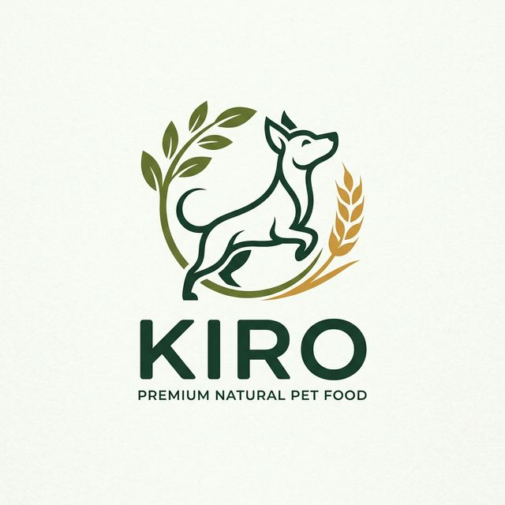
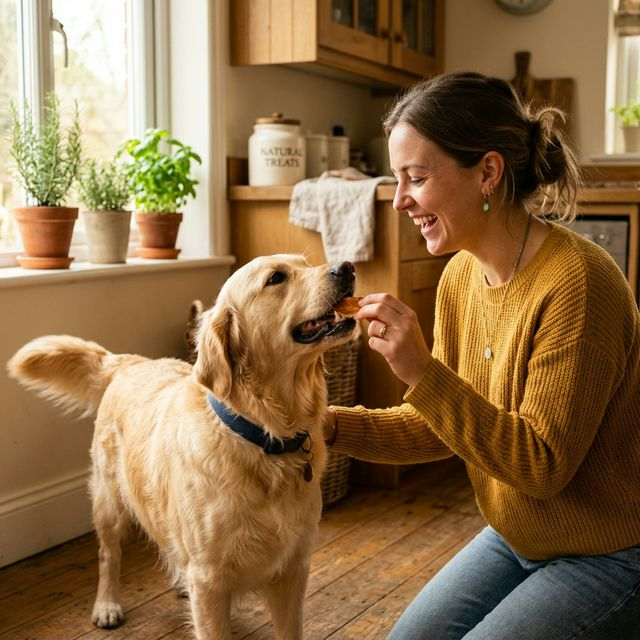
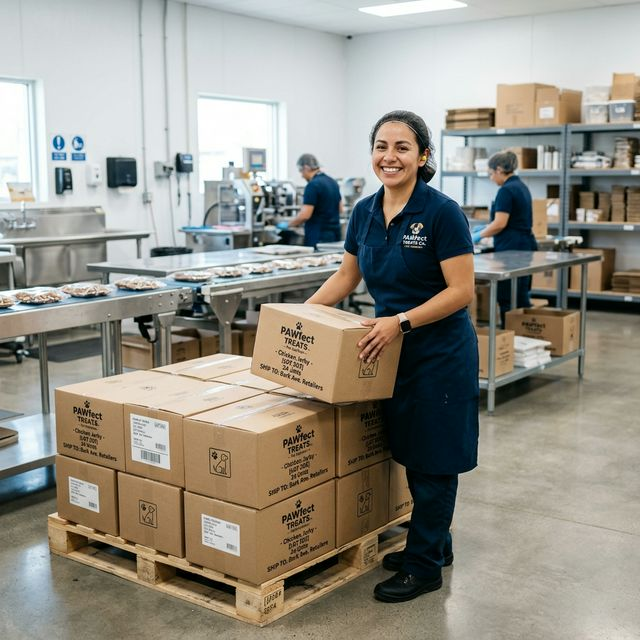
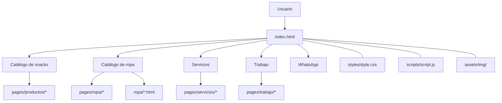
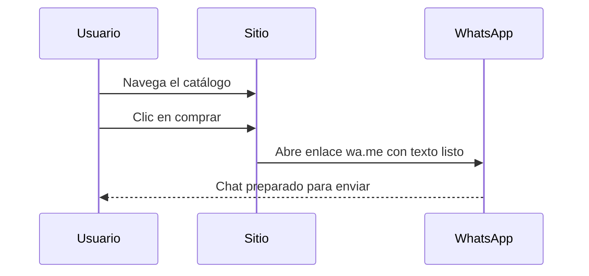
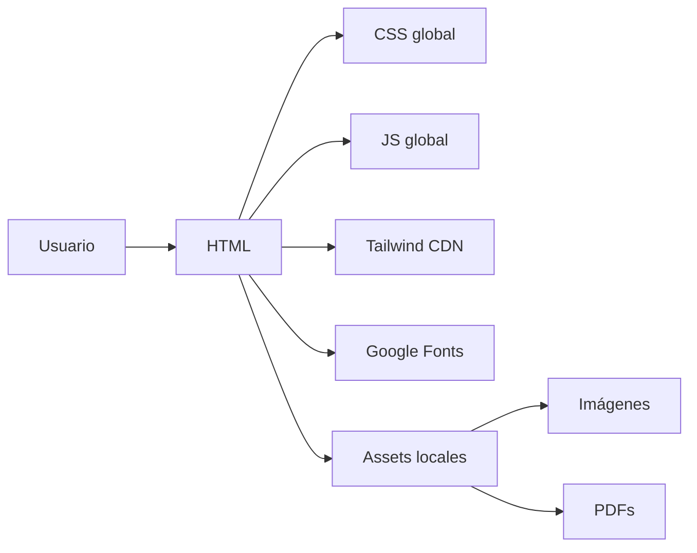
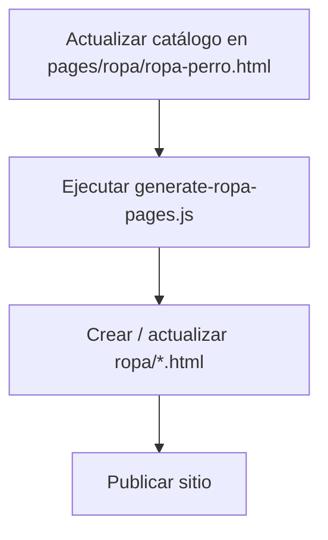

# Kirocorp

<p align="center"><em>Brand experience editorial para snacks premium, ropa para mascotas y contacto directo por WhatsApp.</em></p>

<table>
  <tr>
    <td width="58%" valign="top">

## Portada

**Kirocorp** es una experiencia web comercial diseñada para mostrar catálogo, contar marca y convertir con rapidez.

<p>
  
  
  
  
</p>

<p>
  
  
  
  
</p>

<p>
  <a href="#resumen"></a>
  <a href="#galería"></a>
  <a href="#mapa-visual"></a>
  <a href="#estructura"></a>
</p>

    </td>
    <td width="42%" valign="top">

<p align="center">
  
</p>

<p align="center">
  <strong>🐶 Snacks premium | 👕 Ropa para mascotas | 💬 Venta directa por WhatsApp</strong>
</p>

    </td>
  </tr>
</table>

## Índice

<p>
  <a href="#portada"></a>
  <a href="#galería"></a>
  <a href="#mapa-visual"></a>
  <a href="#resumen"></a>
  <a href="#estructura"></a>
  <a href="#tecnología"></a>
  <a href="#componentes"></a>
  <a href="#automatización"></a>
  <a href="#seo-y-conversión"></a>
  <a href="#mantenimiento"></a>
  <a href="#referencias"></a>
</p>

<table>
  <tr>
    <td width="50%" valign="top">

### Dirección creativa

Sitio web estático multipágina pensado para vender rápido, mostrar catálogo con estilo y llevar al usuario directo a WhatsApp.

**La portada reúne:**

- 🧩 estructura clara del proyecto
- 🖼️ imágenes destacadas del sitio
- 🗺️ diagramas de navegación y automatización
- ⚙️ tecnología y componentes principales

    </td>
    <td width="50%" valign="top">

### Vista rápida

| Área | Ruta |
|---|---|
| Home | `index.html` |
| Snacks | `pages/productos/productos-snack.html` |
| Productos | `pages/productos/producto-*.html` |
| Ropa | `pages/ropa/ropa.html` y `pages/ropa/ropa-perro.html` |
| Fichas de ropa | `ropa/*.html` |
| Servicios | `pages/servicios/kiro*.html` |
| Trabajo | `pages/trabajo/trabajaconnosotros.html` |
| Docs | `docs/` |

    </td>
  </tr>
</table>

## Galería

<table>
  <tr>
    <td width="33%">
      
    </td>
    <td width="33%">
      
    </td>
    <td width="33%">
      
    </td>
  </tr>
  <tr>
    <td align="center"><strong>Logo y marca</strong></td>
    <td align="center"><strong>Campaña visual</strong></td>
    <td align="center"><strong>Equipo y confianza</strong></td>
  </tr>
</table>

## Mapa Visual





## Resumen

Kirocorp es una experiencia web comercial pensada para vender y convertir rápido. El sitio mezcla catálogo, storytelling y contacto directo por WhatsApp.

### Qué ofrece

- 🐶 Snacks naturales premium para mascotas.
- 👕 Ropita para perros y gatitos.
- 🩺 Servicios de marca como entrenamiento, spa, vet y más.
- 💬 Contacto inmediato vía WhatsApp.
- 📄 Catálogo PDF descargable.

## Estructura

```text
kironuevo/
├── index.html
├── pages/
│   ├── productos/
│   ├── servicios/
│   ├── ropa/
│   └── trabajo/
├── ropa/
├── assets/
│   └── img/
├── styles/
│   └── style.css
├── scripts/
│   └── script.js
├── docs/
└── generate-ropa-pages.js
```

### Carpetas clave

- `pages/productos/`: landing y fichas de snacks.
- `pages/servicios/`: páginas de servicios Kiro.
- `pages/ropa/`: catálogo de ropa fuente.
- `ropa/`: páginas generadas para cada prenda.
- `assets/img/`: imágenes del sitio.
- `styles/`: sistema visual.
- `scripts/`: lógica compartida.
- `docs/`: documentación.

## Tecnología

### Stack

- **HTML5** para todas las páginas.
- **CSS3** en [`styles/style.css`](./styles/style.css).
- **JavaScript vanilla** en [`scripts/script.js`](./scripts/script.js).
- **Tailwind CSS por CDN** para utilidades rápidas.
- **Google Fonts** para `Sora` y `Material Symbols Rounded`.

### Infraestructura

- Sitio preparado para hosting estático.
- Sin backend visible.
- Sin `package.json` ni bundler.
- Automatización puntual con Node.js.

### Diagrama de capas



## Componentes

### `styles/style.css`

- Variables de marca.
- Navegación.
- Hero y secciones.
- Cards y helpers visuales.

### `scripts/script.js`

- Año automático en `#year`.
- Menú móvil.
- Observers para animaciones.
- Sombra en nav al hacer scroll.
- Popup de WhatsApp.
- Slider de beneficios.

### `generate-ropa-pages.js`

- Lee el catálogo desde `pages/ropa/ropa-perro.html`.
- Genera fichas individuales en `ropa/`.
- Normaliza slugs.
- Escapa contenido HTML.

## Automatización



### Nota importante

Si cambias la estructura del array `catalog`, el generador puede romperse.
Conviene revisar siempre:

- nombres de campos,
- formato del bloque,
- y rutas de imágenes.

## SEO y conversión

### Conversión

- CTA visible a WhatsApp.
- Mensajes prellenados.
- Botones de compra rápidos.
- PDF descargable.

### SEO

- `title` por página.
- `meta description`.
- `og:*` en páginas clave.
- `twitter:*` en varias páginas.
- JSON-LD en colecciones.

### Piezas visuales destacadas

| Recurso | Uso |
|---|---|
| [`assets/img/kirologoqueda.jpg`](./assets/img/kirologoqueda.jpg) | Logo principal |
| [`assets/img/kiroheader.jpg`](./assets/img/kiroheader.jpg) | Imagen hero |
| [`assets/img/kiro11.jpg`](./assets/img/kiro11.jpg) | Reclutamiento |
| [`assets/img/kiroteam3.png`](./assets/img/kiroteam3.png) | Imagen de equipo |

## Mantenimiento

### Buenas prácticas

- Mantener la paleta de marca.
- Reutilizar `Sora` y `Material Symbols Rounded`.
- Verificar enlaces de WhatsApp al publicar.
- No duplicar lógica que ya exista en `scripts/script.js`.
- Revisar rutas si se mueve alguna página.

### Riesgos conocidos

- Mucha duplicación HTML.
- Páginas pesadas por cantidad de imágenes.
- Dependencia de CDN.
- Generación de ropa sensible a cambios estructurales.

### Checklist corto

- Confirmar navegación entre páginas.
- Verificar imágenes y banners.
- Revisar menú móvil.
- Probar fichas de productos.
- Probar descarga del PDF.

## Referencias

- [`docs/contexto.md`](./docs/contexto.md)
- [`docs/estructura-proyecto.md`](./docs/estructura-proyecto.md)
- [`styles/style.css`](./styles/style.css)
- [`scripts/script.js`](./scripts/script.js)
- [`generate-ropa-pages.js`](./generate-ropa-pages.js)
