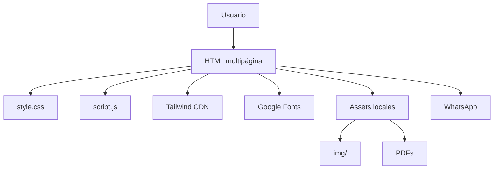
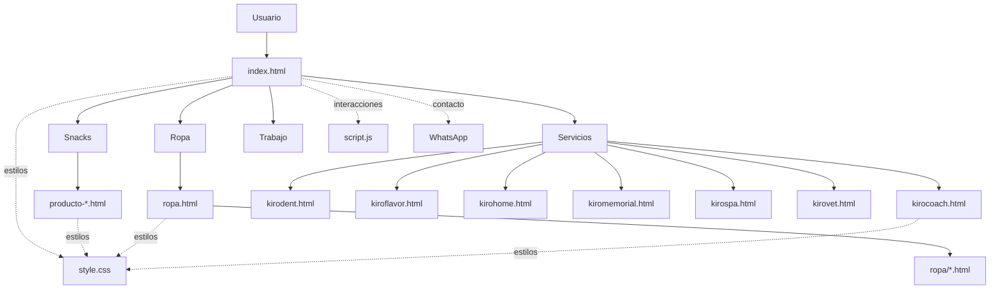
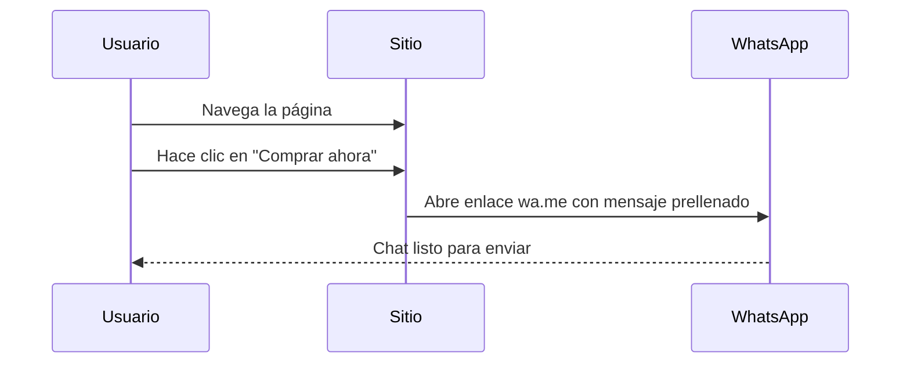
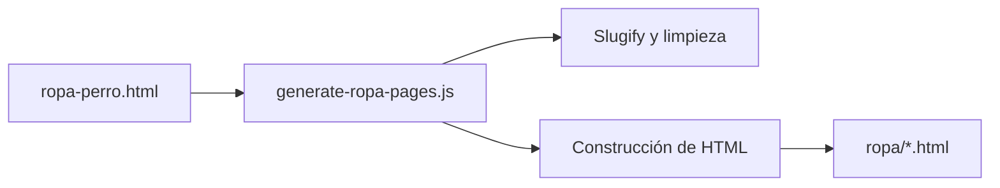
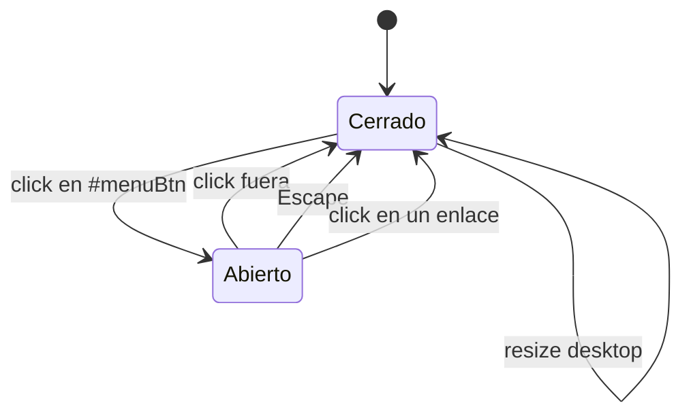
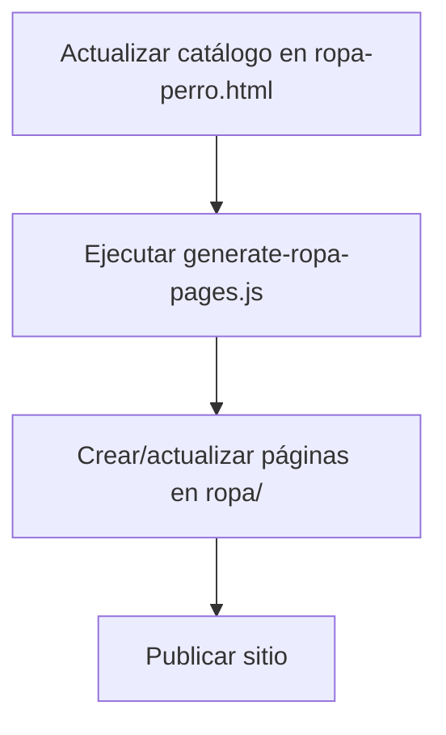

# Kirocorp

> Sistema web estático multipágina para snacks premium, ropa para mascotas y servicios de marca.


## Tabla de Contenidos

- [Visión general](#visión-general)
- [Stack tecnológico](#stack-tecnológico)
- [Arquitectura](#arquitectura)
- [Mapa del sistema](#mapa-del-sistema)
- [Flujos principales](#flujos-principales)
- [Estructura de archivos](#estructura-de-archivos)
- [Componentes globales](#componentes-globales)
- [Dependencias externas](#dependencias-externas)
- [SEO y metadatos](#seo-y-metadatos)
- [Automatización](#automatización)
- [Guía de mantenimiento](#guía-de-mantenimiento)
- [Referencias rápidas](#referencias-rápidas)

## Visión general

Kirocorp es un sitio web de presentación y conversión comercial para una marca orientada al mundo de las mascotas.
El proyecto está pensado para:

- Vender snacks naturales premium.
- Mostrar un catálogo de ropita para perros y gatitos.
- Presentar servicios complementarios de la marca.
- Canalizar consultas y pedidos por WhatsApp.
- Difundir un catálogo PDF descargable.

La solución actual es un **sitio estático multipágina**, sin backend visible y sin framework de frontend.
Esto lo hace simple de publicar, fácil de duplicar por páginas y muy directo para ventas.

### Capacidades principales

| Capacidad | Implementación |
|---|---|
| Landing principal | `index.html` |
| Catálogo de snacks | `productos-snack.html` + `producto-*.html` |
| Catálogo de ropa | `ropa-perro.html` + `ropa.html` + `ropa/*.html` |
| Servicios | `kiro*.html` |
| Contacto | Enlaces `wa.me` |
| Material descargable | `KIROCORP - catalogo 2026.pdf` |
| Automatización | `generate-ropa-pages.js` |

## Stack tecnológico

### Frontend

- **HTML5** como base de todas las páginas.
- **CSS3** centralizado principalmente en [`style.css`](./style.css).
- **JavaScript vanilla** en [`script.js`](./script.js).
- **Tailwind CSS por CDN** en varias páginas para utilidades rápidas.
- **Google Fonts**:
  - `Sora`
  - `Material Symbols Rounded`

### Técnica visual

| Capa | Decisión técnica |
|---|---|
| Tipografía | `Sora` para títulos, textos y UI |
| Iconografía | `Material Symbols Rounded` |
| Sistema de color | Variables CSS en `:root` |
| Layout | Flexbox, CSS Grid y utilidades Tailwind |
| Animación | CSS + `IntersectionObserver` + GSAP opcional |
| Diseño responsive | Breakpoints Tailwind y estilos custom |

### Infraestructura

- Proyecto pensado para **hosting estático**.
- No se detecta `package.json`, ni bundler, ni pipeline de build.
- No hay backend visible en el repositorio.

### Herramientas auxiliares

- [`generate-ropa-pages.js`](./generate-ropa-pages.js): generador de páginas individuales para prendas.
- PDFs e imágenes locales como parte del catálogo y material comercial.

## Arquitectura

La arquitectura responde a un patrón de **multi-page static site**:

- Cada categoría o producto importante tiene su propia página HTML.
- El contenido se organiza por bloques grandes y landing pages.
- La navegación se repite entre páginas.
- Los estilos globales se comparten.
- La interacción común vive en un solo archivo JS.

### Diagrama de capas



### Diagrama general



## Mapa del sistema

### Entrada principal

- [`index.html`](./index.html): portada principal de Kirocorp.

### Catálogo de snacks

- [`productos-snack.html`](./productos-snack.html)
- [`producto-bofe-cordero.html`](./producto-bofe-cordero.html)
- [`producto-colageno.html`](./producto-colageno.html)
- [`producto-higado-cordero.html`](./producto-higado-cordero.html)
- [`producto-higado-pollo.html`](./producto-higado-pollo.html)
- [`producto-mollejas.html`](./producto-mollejas.html)
- [`producto-orejas.html`](./producto-orejas.html)

### Catálogo de ropa

- [`ropa-perro.html`](./ropa-perro.html)
- [`ropa.html`](./ropa.html)
- [`ropa/`](./ropa/)

### Servicios

- [`kirocoach.html`](./kirocoach.html)
- [`kirodent.html`](./kirodent.html)
- [`kiroflavor.html`](./kiroflavor.html)
- [`kirohome.html`](./kirohome.html)
- [`kiromemorial.html`](./kiromemorial.html)
- [`kirospa.html`](./kirospa.html)
- [`kirovet.html`](./kirovet.html)

### Reclutamiento

- [`trabajaconnosotros.html`](./trabajaconnosotros.html)

### Soporte y automatización

- [`style.css`](./style.css)
- [`script.js`](./script.js)
- [`generate-ropa-pages.js`](./generate-ropa-pages.js)
- [`contexto.md`](./contexto.md)

## Árbol del repositorio

```text
kironuevo/
├── index.html
├── style.css
├── script.js
├── generate-ropa-pages.js
├── contexto.md
├── README.md
├── trabajaconnosotros.html
├── productos-snack.html
├── producto-*.html
├── kiro*.html
├── ropa-perro.html
├── ropa/
├── img/
│   ├── productos/
│   ├── ropa/
│   ├── kiroservicios/
│   └── testimonios/
└── KIROCORP - catalogo 2026.pdf
```

## Flujos principales

### 1. Compra y contacto

El sitio está diseñado para que la conversión ocurra rápido:

- CTA principal a WhatsApp.
- Mensajes prellenados para consultas.
- CTA de compra desde home, productos y páginas de servicio.
- Descarga del catálogo PDF desde la portada.



### 2. Exploración de catálogo

- El usuario entra por la home.
- Recorre snacks, ropa o servicios.
- Abre fichas individuales si necesita más detalle.
- Vuelve al CTA para cerrar por WhatsApp.

### 3. Generación de páginas de ropa

El archivo [`generate-ropa-pages.js`](./generate-ropa-pages.js) extrae el catálogo desde [`ropa-perro.html`](./ropa-perro.html) y genera páginas individuales dentro de [`ropa/`](./ropa/).



## Contratos entre archivos

### `index.html`

- Consume `style.css` y `script.js`.
- Expone IDs y clases que el JS espera.
- Es el punto de entrada del usuario.

### `style.css`

- Define tokens visuales de la marca.
- Soporta navegación, hero, cards y secciones.
- Debe mantenerse compatible con las clases usadas por los HTML.

### `script.js`

- Asume que ciertas páginas incluyen menú, nav shell, fallbacks de imágenes y otros nodos.
- Es sensible a IDs y atributos de datos.
- Si un bloque no existe, el script intenta degradar con seguridad.

### `generate-ropa-pages.js`

- Depende de `ropa-perro.html` como fuente de catálogo.
- Produce HTML derivado.
- Si cambia el formato del array `catalog`, el generador puede fallar.

## Estructura de archivos

### Raíz del proyecto

- HTML multipágina para landing, productos y servicios.
- CSS global.
- JS global.
- Generador de páginas.
- Documentación interna.
- PDFs y material comercial.

### Carpetas

- [`img/`](./img/): recursos visuales.
- [`ropa/`](./ropa/): fichas individuales de prendas generadas.

### Subcarpetas relevantes dentro de `img/`

- [`img/kiroservicios/`](./img/kiroservicios/): piezas gráficas de los servicios Kiro.
- [`img/productos/`](./img/productos/): imágenes de snacks/productos.
- [`img/ropa/`](./img/ropa/): catálogo visual de ropita.
- [`img/testimonios/`](./img/testimonios/): fotos de testimonios.

### Inventario visual

| Carpeta | Uso |
|---|---|
| `img/` | Imágenes base del sitio |
| `img/productos/` | Fotos de snacks |
| `img/ropa/` | Fotografías de prendas |
| `img/kiroservicios/` | Creatividades para servicios |
| `img/testimonios/` | Evidencia social y casos |
| `ropa/` | Fichas HTML generadas |

## Componentes globales

## `style.css`

Archivo de estilos base y componentes compartidos.

### Lo que define

- Variables de marca en `:root`.
- Tipografía global.
- Navegación.
- Hero principal.
- Barra de avisos animada.
- Cards y secciones reutilizables.
- Íconos de Material Symbols.

### Piezas destacadas

- `.nav-link`
- `.site-nav`
- `.site-nav-shell`
- `.site-nav-toggle`
- `.site-hero`
- `.notice-bar`
- `.notice-track`
- `.section`
- `.feature-card`

### Contrato visual global

| Recurso | Propósito |
|---|---|
| `.nav-link` | Enlaces de navegación consistentes |
| `.site-nav-shell` | Contenedor visual de la navbar |
| `.site-hero` | Encabezado principal de la home |
| `.notice-bar` | Banda de beneficios/mensajes |
| `.section` | Espaciado y ritmo de páginas internas |
| `.feature-card` | Reutilización de cards promocionales |

## `script.js`

Archivo único para la interacción compartida.

### Responsabilidades

- Inserta el año en `#year`.
- Gestiona el menú móvil.
- Cierra el menú al hacer clic fuera o con `Escape`.
- Aplica animaciones de entrada con `IntersectionObserver`.
- Añade sombra al scroll en la navegación.
- Reubica layouts de detalle en móvil.
- Activa animaciones GSAP si la librería está disponible.
- Muestra un popup de WhatsApp con persistencia de sesión.
- Controla un slider de beneficios.

### Elementos esperados por el script

- `#year`
- `#menuBtn`
- `#menu`
- `[data-site-nav-shell]`
- `.reveal`
- `nav`
- `[data-detail-card]`
- `[data-product-card]`
- `[data-product-media]`
- `[data-product-content]`
- `[data-product-stat]`
- `#waPopup`
- `#waPopupClose`
- `[data-benefits-slider]`

### Máquina de estados del menú



### Puntos de extensión

Si se agrega una nueva vista interactiva, el patrón recomendado es:

1. Marcar el contenedor con `data-*`.
2. Añadir el comportamiento en `script.js`.
3. Definir estilos en `style.css`.
4. Mantener el fallback para mobile/reduced motion.

## Dependencias externas

### En tiempo de ejecución

- **Tailwind CSS CDN**
- **Google Fonts**
- **WhatsApp**

### Dependencias opcionales

- **GSAP**: `script.js` la usa solo si existe en `window.gsap`.

### Observación

El uso de CDN simplifica el mantenimiento, pero añade dependencia de red externa para que el sitio se vea como fue diseñado.

### Matriz de dependencias

| Dependencia | Tipo | Riesgo | Uso |
|---|---:|---:|---|
| Tailwind CDN | runtime | medio | utilidades rápidas |
| Google Fonts | runtime | medio | tipografía y símbolos |
| WhatsApp | externa | medio | conversión |
| GSAP | opcional | bajo | animaciones avanzadas |
| PDFs locales | local | bajo | catálogo descargable |

## SEO y metadatos

Las páginas del sitio incluyen, según el caso:

- `title`
- `meta description`
- `meta keywords`
- `og:title`
- `og:description`
- `og:image`
- `twitter:card`
- `twitter:title`
- `twitter:description`
- JSON-LD en páginas de colección

### Beneficio

Esto mejora:

- Compartidos en redes.
- Presentación en buscadores.
- Cohesión de marca al copiar enlaces.

### Criterios SEO observables

| Criterio | Estado |
|---|---|
| `title` por página | presente |
| `meta description` | presente en varias páginas |
| Open Graph | presente en páginas clave |
| Twitter Cards | presente en algunas páginas |
| JSON-LD | presente en `ropa.html` |
| URLs limpias | multipágina estática |

## Automatización

### Generación de ropa

[`generate-ropa-pages.js`](./generate-ropa-pages.js) cumple una función clave:

- Lee el catálogo embebido en [`ropa-perro.html`](./ropa-perro.html).
- Normaliza nombres.
- Genera fichas HTML individuales.
- Reutiliza patrón visual y enlaces de contacto.

### Diagrama de automatización



### Notas técnicas del generador

- Usa Node.js con `fs` y `path`.
- Extrae el catálogo desde el HTML fuente.
- Construye páginas a partir de templates de string.
- Aplica `slugify` para nombres de archivo.
- Escapa HTML para evitar inyección accidental en contenido generado.

## Guía de mantenimiento

### Buenas prácticas para editar

- Mantener la paleta de marca:
  - naranja `#ff7a1a`
  - azul `#092290`
  - azul secundario `#004C97`
- Reutilizar `Sora` y `Material Symbols Rounded`.
- Evitar duplicar lógica si un componente ya existe en `script.js`.
- Verificar que los IDs y atributos esperados por el JS sigan presentes.
- Si se toca ropa, revisar que el generador siga encontrando `const catalog = [...]`.

### Riesgos conocidos

- Mucha duplicación entre archivos HTML.
- Páginas grandes y pesadas por cantidad de imágenes.
- Dependencia de CDN para estilos y fuentes.
- Generación de ropa frágil si se altera la estructura de `ropa-perro.html`.

### Checklist rápido antes de publicar

- Revisar enlaces de WhatsApp.
- Verificar que las imágenes carguen.
- Confirmar que el menú móvil abra y cierre.
- Revisar `title` y descripción de cada página.
- Probar el PDF descargable.
- Comprobar que el catálogo de ropa siga generando fichas.

## Notas de ingeniería

### Rendimiento

- El sitio es liviano en lógica, pero puede ser pesado en imágenes.
- Conviene optimizar formatos y tamaños de `img/`.
- El uso de CDN reduce trabajo de bundle, pero aumenta dependencia externa.

### Accesibilidad

- Hay uso de `alt` en imágenes relevantes.
- El menú móvil tiene atributos ARIA.
- El script intenta degradar con `prefers-reduced-motion`.
- Los iconos son decorativos cuando corresponde y se marcan con `aria-hidden`.

### Escalabilidad

- El sistema escala mejor agregando páginas nuevas que generando componentes complejos.
- Si el volumen de páginas crece, sería razonable migrar a un generador de sitio o una plantilla común.

### Observabilidad manual

No hay telemetría ni analítica declarada en el repositorio.
Si se incorpora medición de conversión, conviene centralizarla para no repetir scripts en cada HTML.

## Referencias rápidas

### Archivos clave

- [`index.html`](./index.html)
- [`style.css`](./style.css)
- [`script.js`](./script.js)
- [`generate-ropa-pages.js`](./generate-ropa-pages.js)
- [`contexto.md`](./contexto.md)

### Recursos visuales importantes

- [`img/kirologoqueda.jpg`](./img/kirologoqueda.jpg)
- [`img/kiroheader.jpg`](./img/kiroheader.jpg)
- [`img/kiro11.jpg`](./img/kiro11.jpg)

### Documento comercial

- [`KIROCORP - catalogo 2026.pdf`](./KIROCORP%20-%20catalogo%202026.pdf)

---

Si vas a extender el proyecto, este README y [`contexto.md`](./contexto.md) deberían actualizarse juntos para mantener la documentación alineada con la implementación.
